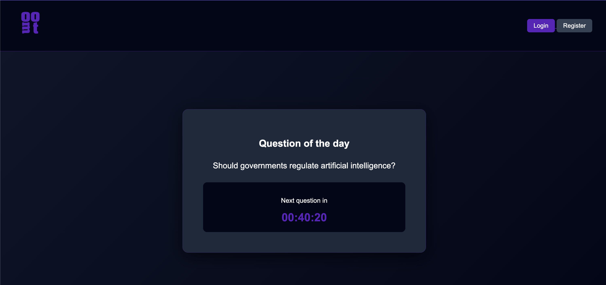
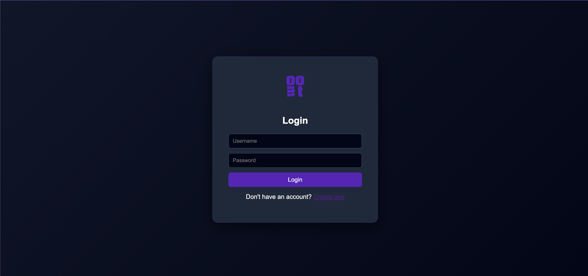
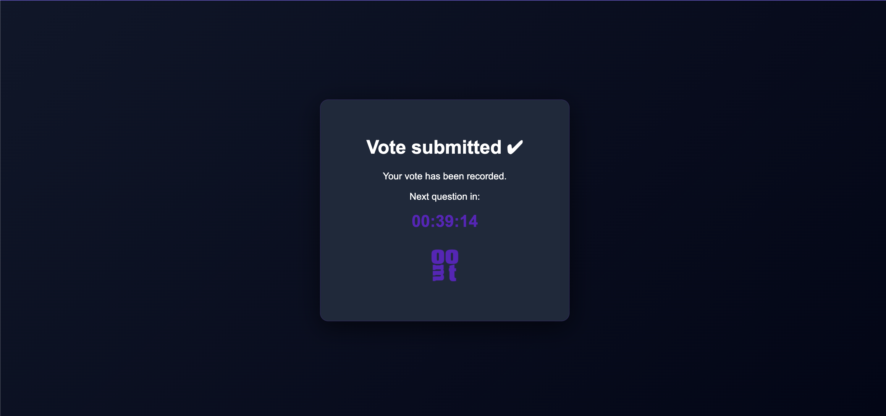
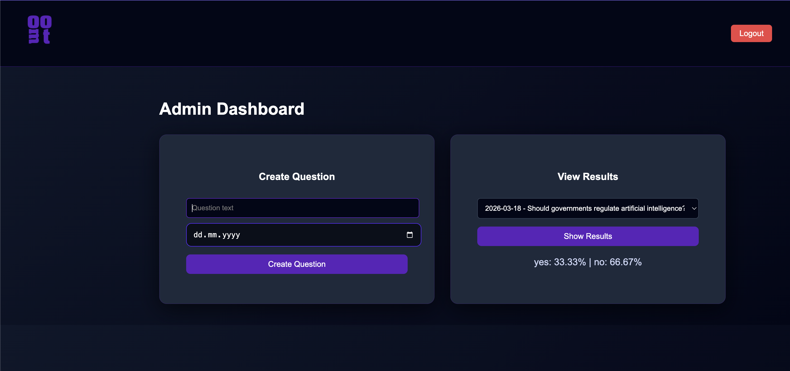

# Moot – Daily Voting Application

Moot is a full-stack web application where users vote on a **daily yes/ no question**. Only the admin can see the results.

The application demonstrates backend development using **Spring Boot**, secure authentication with **Spring Security**, and a simple interactive UI.

---

## Preview

<h3>Home</h3>


<h3>Login</h3>


<h3>Voted</h3>


<h3>Admin</h3>


---

# Features

* User registration and authentication
* Role-based access control (USER / ADMIN)
* Daily question voting system
* One vote per user per day
* Automatic daily question logic based on date
* Admin dashboard for creating questions
* Vote statistics and results
* Countdown timer until the next question
* Clean responsive UI

---

# Tech Stack

### Backend

* Java 21
* Spring Boot
* Spring Security
* Spring Data JPA
* Hibernate

### Database

* PostgreSQL

### Frontend

* HTML
* CSS
* JavaScript

### Tools

* IntelliJ IDEA
* Git
* GitHub

---

# Architecture

The project follows a layered architecture:

```
Controller → Service → Repository → Database
```

Structure:

```
src/main/java
 ├── config
 ├── controller
 ├── domain
 ├── repository
 ├── service
 ├── exception

src/main/resources
 ├── static
 │    ├── css
 │    └── js
 │    └── images
 └── templates
```

---

# How It Works

1. Users create an account and log in.
2. Each day a question is available to vote on.
3. A user can vote **only once per question**.
4. After voting, the user is redirected to a confirmation page.
5. Admins can create questions from the admin dashboard.

The active question is determined automatically using the question date.

---

# Setup Instructions

### 1. Clone the repository

```
git clone https://github.com/andramates/moot.git
cd moot
```

### 2. Configure the database

Update `application.properties`:

```
spring.datasource.url=jdbc:postgresql://localhost:5432/moot
spring.datasource.username=postgres
spring.datasource.password=yourpassword
```

```sql
CREATE TABLE users (
    id INT GENERATED ALWAYS AS IDENTITY PRIMARY KEY,
    username VARCHAR(50) UNIQUE NOT NULL,
    password VARCHAR(255) NOT NULL,
    role VARCHAR(10) NOT NULL CHECK (role IN ('USER', 'ADMIN')),
    created_at TIMESTAMP DEFAULT CURRENT_TIMESTAMP
);

CREATE TABLE questions (
    id INT GENERATED ALWAYS AS IDENTITY PRIMARY KEY,
    text TEXT NOT NULL,
    question_date DATE NOT NULL UNIQUE,
    created_at TIMESTAMP DEFAULT CURRENT_TIMESTAMP
);

CREATE TABLE votes (
    id INT GENERATED ALWAYS AS IDENTITY PRIMARY KEY,
    user_id INT NOT NULL,
    question_id INT NOT NULL,
    answer VARCHAR(3) NOT NULL CHECK (answer IN ('YES', 'NO')),
    created_at TIMESTAMP DEFAULT CURRENT_TIMESTAMP,
    
    CONSTRAINT fk_vote_user
        FOREIGN KEY (user_id) REFERENCES users(id)
        ON DELETE CASCADE,

    CONSTRAINT fk_vote_question
        FOREIGN KEY (question_id) REFERENCES questions(id)
        ON DELETE CASCADE,

    CONSTRAINT unique_vote_per_user_per_question
        UNIQUE (user_id, question_id)
);
```

### 3. Run the application

```
./gradlew bootRun
```

or run the main class from IntelliJ.

Application runs at:

```
http://localhost:8080
```

---

# User Roles

### User

* Vote on the daily question

### Admin

* Create new questions
* View voting statistics

---

### Future version

* User can see question history

---

# Author

**Andra Mates**

GitHub:
https://github.com/andramates
